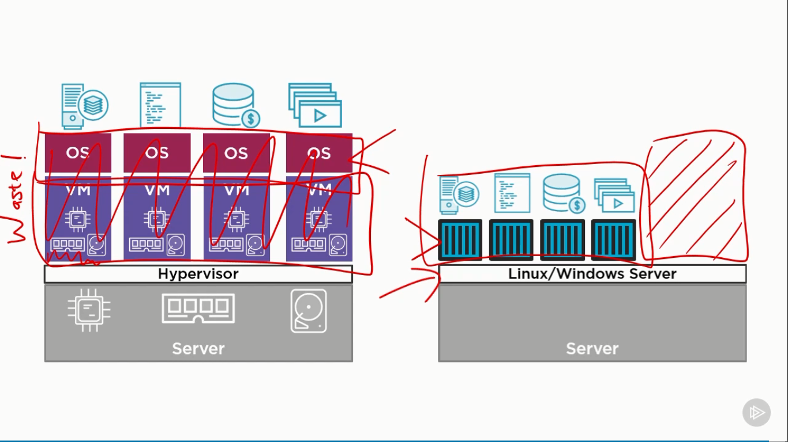
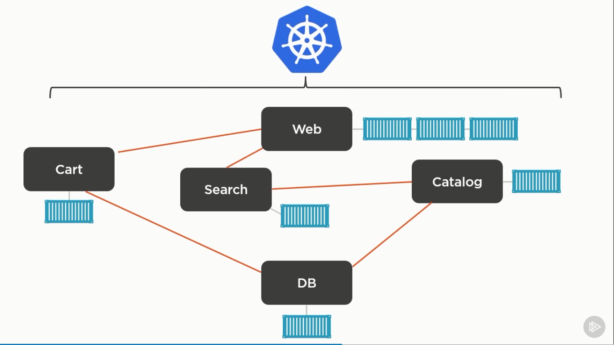

# Docker and Kubernetes: The Big Picture

Course outline

- Basics on containers
- Docker and Kubernetes
- Microservices and cloud-native
- Thriving in a container world
- Current state of the union

Aim of the Game

- Get up to speed
- Give directions
- Cover fundamentals

Agenda

- Container Primer
- Docker
- Kubernetes
- Thriving in a Container world
- Suitable Workloads
- Enterprise & Production Readiness
- A world on orchestration
- What next

## 1. Containers: Primer

### 1.1. The bad old days

1 Ứng dụng chạy trên 1 Server lớn, chậm chạp, lãng phí nhiều tài nguyên

### 1.2. VMWare

Trong hình trên, ta tạo ra 4 máy ảo. Mỗi máy ảo chiếm 25% tài nguyên trên server.
Tiếp đó, mỗi máy ảo cần 1 hệ điều hành riêng, kèm theo chi phí về bản quyền, các
thao tác quản lý, phân quyền, phòng tránh virus,...

### 1.3. Containers

Công nghệ này đóng gói các ứng dụng vào các Container riêng biệt. Các ưu điểm bao
gồm: nhanh, cực nhanh, bảo mật, không tốn chi phí cài hệ điều hành như VMware,
phần không gian trống có thể dùng để chạy các ứng dụng khác (So với pnần lãng phí
của VMWare phía trên).

Nền tảng cho

- Microservices
- Cloud-Native

## 2. Docker

### 2.1. Docker, Inc

Công ty đứng đằng sau công nghệ docker

### 2.2. Docker the Technology

Giống như một máy ảo siêu nhẹ, siêu nhanh, docker hỗ trợ việc chạy 1 ứng dụng bên
trong container một cách nhanh chóng và dễ dàng.

Một ứng dụng chạy trong container được gọi là `Containerizing App`

## 3. Kubernetes

Dự án open source của Google. Còn được gọi là: `k8s`

- docker chịu trách nhiệm cho việc khởi động, tạm dừng, xoá bỏ,... container. (Low-level stuff)
- kubernetes: scheduling, scaling, healing, updating,... (high-level stuff)

Ví dụ về 1 dàn nhạc, trong đó có rất nhiều nghệ sĩ chơi các loại nhạc cụ khác nhau.
Mỗi nghệ sĩ này có thể được xem như 1 `containerizing app`, chạy bởi docker. Và,
kubuernetes như là nhạc trưởng, điều khiển, chỉ dẫn mọi hoạt động của các nghệ sĩ
kia. Cùng phối hợp để tạo ra 1 ứng dụng chạy mượt mà, hiệu quả.

## 4. Overview on Microservices

