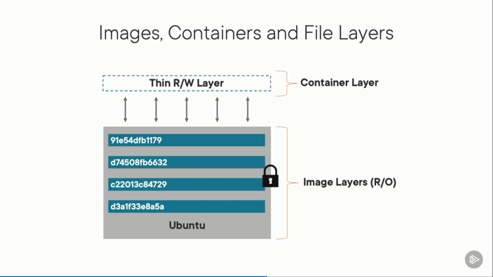
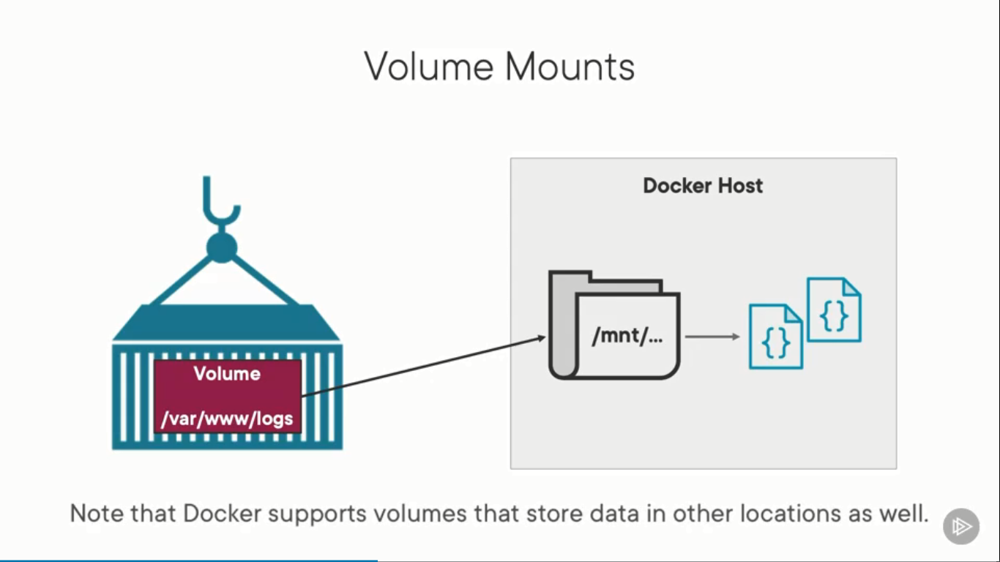

# Building and Running Your First Docker App

Overview

- Why use containers?
- Building custom app images
- Running your app containers
- Communicating between containers
- Orchestrating container builds and runs using Docker composer

## 1. Setting up Development Environment

Module overview

- The case for Docker
  - Review Docker concepts
  - What are key benefits of using Docker?
- Software installation
  - Install Docker Desktop
  - Explore preferences
- Examine the Application

### 1.1. The case for Docker

- Accelerate Developer Onboarding
- Eliminate App Conflicts
- Environment Consistency
- Ship software faster

Images and Containers

- Docker image: Define the contents that are needed to run a container
- Docker container: Runs your application

Image: A read-only template composed of layered filesystems used to
share common files and create Docker container instances

Container: An isolated and secured shipping container created
from an image that can be run, started, stopped, moved and deleted.

## 2. Create an Application Image

### 2.1. Dockerfile

A dockerfile is a text document that contains all the commands a
user could call on the command line to assemble an image

- Base layer: `FROM` instruction
- Metadata: `LABEL` instruction, `author`
- Environment variable: `ENV` instruction
- Working directory: `WORKDIR`, starting point of container
- Copy code into `WORKDIR`: `COPY . .`, copy everything from current
  directory into `WORKDIR` directory inside container
- Run a command: `RUN`
- Expose port which application is listening on `EXPOSE`
- The first command to fire up the application: `ENTRYPOINT`

```Dockerfile
FROM        node:15.9.0-alpine

LABEL       author="Trong Hieu"

ENV         NODE_ENV=production
ENV         PORT=8000

WORKDIR     /var/www
COPY        package.json package-lock.json ./
RUN         npm install

COPY        . ./

EXPOSE      $PORT

ENTRYPOINT [ "npm", "start" ]
```

Learn more at: [Docker documentation](https://docs.docker.com/engine/reference/builder)

### 2.2. Using Docker Build

Building a Custom Image

`docker build -t <name> .`

- `t`: tag
- `<name>`: image name
- `.`: context, Where is the Dockerfile relative to where you're running this command?

Using Registry name, Image name and Tag

`docker build -t <registry>/<name>:<tag> .`

Docker Image Commands

- `docker images`: List Docker images
- `docker rmi <imageID>`: Remove an image

Docker build with custom Dockerfile
`docker build -t dalatcoder/nodeapp:1.0 -f node.dockerfile .`

Update image?

Image are immutable, create new image with new tag

### 2.3. Deploy an Image to a Registry

- To Docker Hub

`docker push <username>/<image_name>:<tag>`

## 3. Run an containized application



Pull image using `docker pull <image_name>`
Running a Container: `docker run`

- `p`: port, mapping port from outside to inside container
  `<externalPort>:<internalPort>`

Using Docker Run
`docker run -d -p 8000:80 nginx:alpine`

- `d`: detact terminal, running in background
- `p`: mappping port

List docker container statuses: `docker ps` or `docker ps -a`

Remove a container: `docker rm <ID>`

View Container Logs

`docker logs <containerID>`

Using Container Volumes

As you work with containers, there's going to be times where you write
files or you have database files or others that need to be saved outside
of the container.
That way, if the container is removed, you don't lose your files.
That's what volumes can help us with.

Storing Data Outside of a Container

Volume Mount

- Volume: `/var/www/logs`
- Create `/mnt` folder on Docker host



Create a Container Volume
`docker run -p <posrts> -v /var/www/logs <image>`

Defining a Host Location
`docker run -p <ports> -v $(pwd):/var/www/logs <image>`
or
`docker run -p <ports> -v ${PWD}:/var/www/logs <image>` (on Windows)

Volume Scenarios

- Production Scenarios (logs, database files and more)
- Development Scenarios (develop using container)

Development:

- ngnix:alpine
- static folder contains `index.html` on Docker host
- Mount that volume to `home` (`/usr/share/nginx/html`) directory inside nginx container
- Start container
- `$(pwd)`: Current directory contain README.md file

`docker run -d -p 8000:80 -v $(pwd)/nginx:/usr/share/nginx/html nginx:alpine`

Production:

- Mount logs folder
