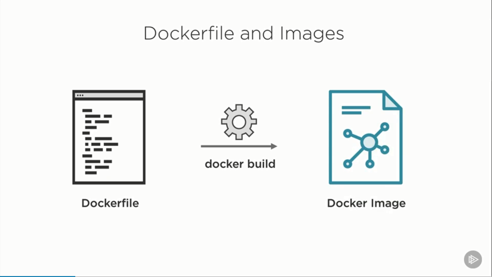

# Docker For Web Developers

## 1. Why use docker as a Developer?

### 1.1. What is Docker?

- Lightweight, open, secure platform
- Simplify building, shipping, running apps
- Shipping container system for code
- Runs natively on Linux or Windows Server
- Runs on Windows or Mac development machines (with a virtual machine)
- Relies on 'images' and 'containers'

### 1.2. The role of Images and Containers

An image is something that's used to build a container. An image will have the necessary files
to run something on an operating system like Ubuntu or Windows. Think of an image as the
blueprint that's used to actually get a running container going.

Containers are actually where the live application runs, or the database or caching server
or whatever it may be that you need to actually run on a Linux or a Windows Server machine.

Image

> A read-only template composed of layered filesystems used to share common files
> and create Docker container instances.

Container

> An isolated and secured shipping container created from an image that can be run,
> started, stopped, moved and deleted.

In a nutshell, an image is used to create an instance of the running container.


### 1.3. Docker Benefits (for Web Developers)

- Accelerate Developer Onboarding
- Eliminate App Conflicts
- Environment Consistency
- Ship Software Faster

## 2. Getting started with Docker

### 2.1. Docker Client Overview

- Interact with Docker Engine
- Build and Manage Images
- Run and Manage Containers

Key Docker Client Commands

- `docker pull [image_name]`
- `docker run [image_name]`
  - `-p <external_port>:<internal_port>`
- `docker images`: list all images
- `docker ps -a`: list all containers
- `docker rm [container_id]`: remove a container
- `docker rmi [image_id]`: remove a image

## 3. Hooking Your Source Code into a Container

Module Agenda

- The layered file system
- Containers and Volumes
- Source code, volumes and containers
- Hooking a Container volume to Source code
- Removing Containers and Volumes

Question: How do you get source code into a container?

Answer:

- Create a container volume that points to the source code
- Add your source code into a custom image that is used to create a container

### 3.1. The layered file system

Images, Containers and File Layers


Containers Can Share Image Layers


Docker Images bao gồm rất nhiều các layer chồng lên nhau. Các lớp này read-only,
không thể ghi dữ liệu vào được. Các lớp này đảm bảo cho container có thể hoạt động được.
Khi tạo ra container, container cung cấp thêm các lớp để đọc và ghi dữ liệu vào
chính container. Bởi vì Images là read-only nên nó có thể dùng chung cho nhiều
container khác nhau. Mỗi container cung cấp các lớp để tự đọc/ghi dữ liệu vào chính
nó. Tuy nhiên, khi xoá container, dữ liệU này cũng mất đi. Để lưu trữ dữ liệu
bên ngoài container (khi xoá container thì dữ liệu sẽ không mất), chúng ta cần
`Volume`.

### 3.2. Containers and Volumes

What is a volume?

- Special type of directory in a container typically referred to as a "data volume".
  We can store all sort of data into it: code, log files, data files,...
- Can be shared and reused among containers
- Updates to an image won't effect a data volume
- Data volumes are persisted even after the container is deleted


### 3.3. Source code, Volumes and Containers

`docker run -p 8000:3000 -v $(pwd):/var/www node`

`docker inspect <container_name>`: "Mounts attribute"

### 3.4. Hooking a Volume to Node.JS Source Code

`docker rm -v <container_id>`: Remove container and its volumes

Các bước thực hiện

- `npm install express express-generator -g`: cài đặt bộ công cụ sinh dự án tự động của express
- `express NodeJS --hbs`: sinh dự án tự động, sử dụng view engine là `hbs`
- `docker pull node`: Sử dụng `latest` hoặc 1 tag nào đó
- Hook source code into node container
  - Di chuyển tới thư mục `NodeJS`, `cd nodejs`
  - `docker run -p 8000:3000 -v %cd%:/var/www -w "/var/www" node npm start`
    - `p`: Port mapping
    - `v`: Volume, `%cd% <=> $(pwd)`
    - `w`: Working directory, define `context` where to run `npm start` inside the container
    - `node`: Name of the container
    - `npm start`" Command to start nodejs server
- Mở trình duyệt web, truy cập vào địa chỉ: `localhost:8000`

### 3.5. Hooking a Volume to ASP.NET Core Source Code

- `dotnet new mvc DemoApp`
- `docker pull mcr.microsoft.com/dotnet/core/sdk`
- `cd DemoApp`
- `docker run -it -p 8080:5000 -v %cd%:/app -w "/app" mcr.microsoft.com/dotnet/core/sdk /bin/bash`
- `dotnet build`
- `dotnet run`
- `dotnet watch run`
- `Ctrl P Q` to detach `tty`

## 4. Building Custom Images with Dockerfile

### 4.1. Dockerfile and Images

Docker is a text file with instructions in it.



Dockerfile overview

- Text file used to build Docker images
- Contains build instructions
- Instructions create intermediate that can be cached to speed up future builds
- Used with `docker build` command

Key Dockerfile instructions

- `FROM`: specified based image, custom image build on top of this image with
  custom layered file system.
- `LABEL`: who maintain, author...
- `RUN`: run a command inside container
- `COPY`: copy source code into container for production
- `ENTRYPOINT`: entrypoint for container
- `WORKDIR`: set context for where the container actually run (e.g. Entrypoint)
- `EXPOSE`: expose port from container
- `ENV`: define environment variable
- `VOLUME`: define volume

### 4.2. Creating a custom Node.JS Dockerfile

```Dockerfile
  FROM        node:latest

  LABEL       author="Trong Hieu"

  ENV         NODE_ENV=production
  ENV         PORT=3000

  COPY        . /var/www
  WORKDIR     /var/www

  VOLUME [ "/var/www"]

  RUN         npm install

  EXPOSE      $PORT

  ENTRYPOINT  [ "npm", "start" ]
```

### 4.3. Building a Custom Image

`docker build -f <dockerfile_name> -t <dockerhub_id>/<image_name>:<image_tag> .`

Intermediated container will be cache.

Run with `docker run -d -p 8000:3000 <image_name>`

### 4.3. Creating a custom ASP.NET Core Dockerfile

Build Docker image for development

```Dockerfile
  FROM        mcr.microsoft.com/dotnet/core/sdk

  LABEL       author="Trong Hieu"

  ENV         ASPNETCORE_URLS=http://*:5000
  ENV         DOTNET_USE_POLLING_FILE_WATCHER=1
  ENV         ASPNETCORE_ENVIRONMENT=development

  WORKDIR     /app

  ENTRYPOINT  [ "/bin/bash", "-c", "dotnet restore && dotnet watch run" ]
```

Build Docker image for production (Multi-state Dockerfile)

## 5. Communicating between Docker containers

Module Agenda

- Getting started with Container linking
- Linking Containers by Name (legacy linking)
- Container Linking in Action
- Getting Started with Container Networks
- Container Networks in Action
- Linking Multiple Containers

### 5.1. Getting Started with Container Linking

Options

- Legacy Linking (Using Container Name)
- Add Containers to a Bridge Network

### 5.2. (Legacy) Linking using Container name

Steps to Link Containers

1. Run a Container with a name
2. Link to Running Container by Name
3. Repeat for Additional Container

`docker run -d --name my-postgres postgres`

Link to running container by name

`docker run -d -p 8000:5000 --link my-postgres:postgres dalatcoder/aspnetcore`

- `--link`: Link to named container
- `my-postgres:postgres`:
  - `my-postgres`: Name of linked container
  - `postgres`: Linked container alias (Using inside `dalatcoder/aspnetcore` for `database connection string`)

### 5.3. Linking Node.js and MongoDB Containers

`legacylinking.dockerfile`

```Dockerfile
  FROM node:latest

  LABEL author="Trong Hieu"

  ENV NODE_ENV=development
  ENV PORT=3000

  COPY . /var/www
  WORKDIR /var/www

  RUN npm install

  EXPOSE $PORT

  ENTRYPOINT [ "npm", "start" ]
```

Build image: `docker build -t legacynodelinking -f legacylinking.dockerfile .`

Start MongoDB with custom name (`my-mongodb`): `docker run -d --name my-mongodb mongo`

Start Node and Link to MongoDB container

`docker run -d -p 3000:3000 --link my-mongodb:mongodb legacynodelinking`

- `d`: deattach terminal
- `p`: mapping port
- `--link`: to link `legacynodelinking` container to `my-mongodb` container
- `mongodb`: alias name, use for connection string inside `legacynodelinking` container.
  See at (`LinkingNodeToMongoDB/config/config.development.json`)

Seed data to MongoDB

- Go inside `legacynodelinking` container: `docker exec -it legacynodelinking sh`
- Running `node dbseeder.js`

Or

- Running: `docker exec legacynodelinking node dbseeder.js`

### 5.4. Linking ASP.NET Core and PostgreSQL Containers

```Dockerfile
  FROM mcr.microsoft.com/dotnet/core/sdk

  LABEL author="Dan Wahlin"

  ENV ASPNETCORE_URLS=http://+:5000

  WORKDIR /var/www/aspnetcoreapp

  COPY . .

  EXPOSE 5000

  ENTRYPOINT ["/bin/bash", "-c", "dotnet restore && dotnet run"]
```

Build image: `docker build -f aspnetcore.dockerfile -t legacyaspcore .`

Pull PostgreSQL images: `docker pull postgres`

Run PostgresQL container: `docker run -d --name my-postgres -e POSTGRES_PASSWORD=password postgres`

Link `legacyaspcore` container with `my-postgres` container
`docker run -d -p 8000:5000 --link my-postgres:postgres legacyaspcore`

`postgres`: alias name used inside `legacyaspcore` container. See `appsetings.json`.

Go to `localhost:8000/Home/Index`

> Always setup try catch when connect to Database
