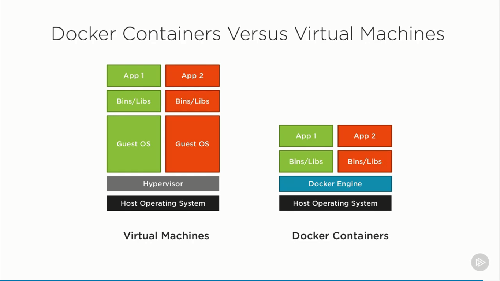
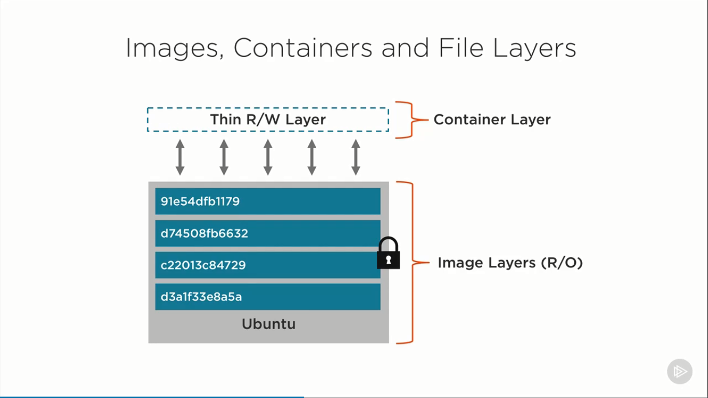
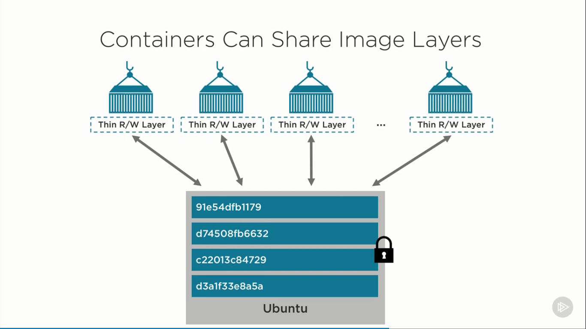
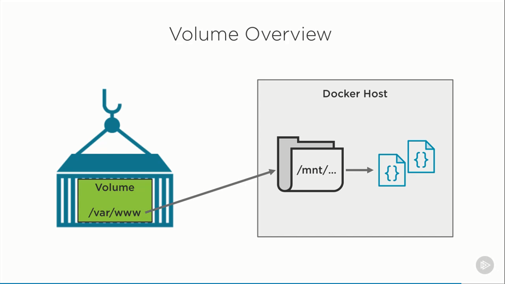

# Docker For Web Developers

## 1. Why use docker as a Developer?

### 1.1. What is Docker?

- Lightweight, open, secure platform
- Simplify building, shipping, running apps
- Shipping container system for code
- Runs natively on Linux or Windows Server
- Runs on Windows or Mac development machines (with a virtual machine)
- Relies on 'images' and 'containers'

### 1.2. The role of Images and Containers

An image is something that's used to build a container. An image will have the necessary files
to run something on an operating system like Ubuntu or Windows. Think of an image as the
blueprint that's used to actually get a running container going.

Containers are actually where the live application runs, or the database or caching server
or whatever it may be that you need to actually run on a Linux or a Windows Server machine.

Image

> A read-only template composed of layered filesystems used to share common files
> and create Docker container instances.

Container

> An isolated and secured shipping container created from an image that can be run,
> started, stopped, moved and deleted.

In a nutshell, an image is used to create an instance of the running container.

### 1.3. Docker Benefits (for Web Developers)

- Accelerate Developer Onboarding
- Eliminate App Conflicts
- Environment Consistency
- Ship Software Faster

## 2. Getting started with Docker

### 2.1. Docker Client Overview

- Interact with Docker Engine
- Build and Manage Images
- Run and Manage Containers

Key Docker Client Commands

- `docker pull [image_name]`
- `docker run [image_name]`
  - `-p <external_port>:<internal_port>`
- `docker images`: list all images
- `docker ps -a`: list all containers
- `docker rm [container_id]`: remove a container
- `docker rmi [image_id]`: remove a image

## 3. Hooking Your Source Code into a Container

Module Agenda

- The layered file system
- Containers and Volumes
- Source code, volumes and containers
- Hooking a Container volume to Source code
- Removing Containers and Volumes

Question: How do you get source code into a container?

Answer:

- Create a container volume that points to the source code
- Add your source code into a custom image that is used to create a container

### 3.1. The layered file system

Images, Containers and File Layers

Containers Can Share Image Layers

Docker Images bao gồm rất nhiều các layer chồng lên nhau. Các lớp này read-only,
không thể ghi dữ liệu vào được. Các lớp này đảm bảo cho container có thể hoạt động được.
Khi tạo ra container, container cung cấp thêm các lớp để đọc và ghi dữ liệu vào
chính container. Bởi vì Images là read-only nên nó có thể dùng chung cho nhiều
container khác nhau. Mỗi container cung cấp các lớp để tự đọc/ghi dữ liệu vào chính
nó. Tuy nhiên, khi xoá container, dữ liệU này cũng mất đi. Để lưu trữ dữ liệu
bên ngoài container (khi xoá container thì dữ liệu sẽ không mất), chúng ta cần
`Volume`.

### 3.2. Containers and Volumes

What is a volume?

- Special type of directory in a container typically referred to as a "data volume".
  We can store all sort of data into it: code, log files, data files,...
- Can be shared and reused among containers
- Updates to an image won't effect a data volume
- Data volumes are persisted even after the container is deleted

### 3.3. Source code, Volumes and Containers

`docker run -p 8000:3000 -v $(pwd):/var/www node`

`docker inspect <container_name>`: "Mounts attribute"

### 3.4. Hooking a Volume to Node.JS Source Code

`docker rm -v <container_id>`: Remove container and its volumes

Các bước thực hiện

- `npm install express express-generator -g`: cài đặt bộ công cụ sinh dự án tự động của express
- `express NodeJS --hbs`: sinh dự án tự động, sử dụng view engine là `hbs`
- `docker pull node`: Sử dụng `latest` hoặc 1 tag nào đó
- Hook source code into node container
  - Di chuyển tới thư mục `NodeJS`, `cd nodejs`
  - `docker run -p 8000:3000 -v %cd%:/var/www -w "/var/www" node npm start`
    - `p`: Port mapping
    - `v`: Volume, `%cd% <=> $(pwd)`
    - `w`: Working directory, define `context` where to run `npm start` inside the container
    - `node`: Name of the container
    - `npm start`" Command to start nodejs server
- Mở trình duyệt web, truy cập vào địa chỉ: `localhost:8000`
