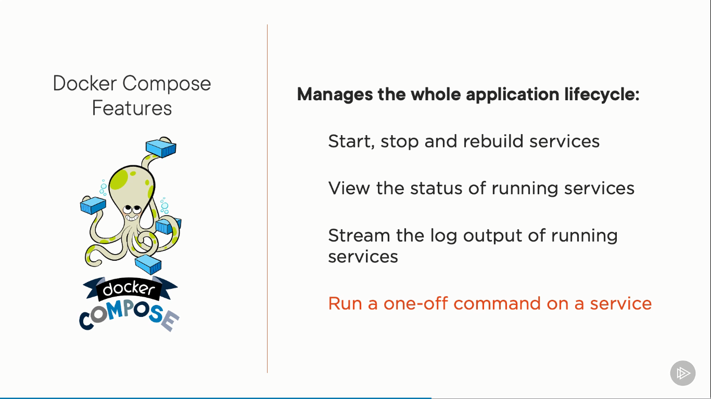

# Building and Orchestrating Containers with Docker Compose

Overview

- Why use Docker Compose
- YAML fundamentals
- Build one or more images
- Ports, volumes, variables and networks
- Container orchestration
- Additional features

## 1. Getting started with Docker Compose

### 1.1. The role of Docker Compose





### 1.2. YAML

- YAML files are composed of maps and lists
- Indentation matters (be consistent!)
- Always use spaces
- Maps:
  - name: value pairs
  - Maps can contain other maps for more complex data structures
- Lists:
  - Sequence of items
  - Multiple maps can be defined in a list


### 1.3. Create a Docker Compose File

`docker-compose.yml`

```yml
version: '3.x'

services:

networks:
```

## 2. Building Images with Docker Compose

Key Docker Compose Build Properties

- `context`
- `dockerfile`: name of the dockerfile
- `args`: build arguments
- `image`: name of the built image

```yml
services:
  node:
    image: nodeapp
    build:
      context: .
      dockerfile: node.dockerfile
      args:
        buildversion: 1
    ports:
      - '3000:3000'
```

Define `ARGS` in `Dockerfile` and fill `args` in build process

Run:

- `docker-compose build`
- `docker compose build`
